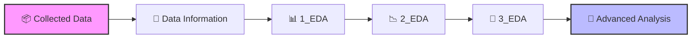

# **GENTD26 Dataset:** 

Cloud is a structure that hosts Databases, Storage, Compute (Computation, processing powers), Networking... The GENTD26 data, on the other hand, is a dataset collected to monitor GenAI-focused operations intended to be performed on AI models. We have an end-to-end Stable Diffusion architecture used to generate high-resolution images. The movements within the Cloud during the operations of this architecture are examined. GENTD26, across 3 layers, is the dataset of a recorded BLACK BOX / SURVEILLANCE system capturing the end-to-end architecture (all the efficiency, malfunctions, and fuel consumption of the factory). This system that collects data focuses on Stable Diffusion GenAI usage. This dataset captures performance data across three architectural layers, providing a comprehensive GENTD26 top-down view of a large-scale generative AI server system:

1. `Application Layer (user requests & end-to-end latency):` This layer is the "human-facing" side of the system. Here, GENTD asks this question: "How long did the user wait?
2. `Middleware (gateway queues & schedulers & pipeline method):` The image generation command waits at this "intermediate stop" before going to the GPU. Here, GENTD measures the management efficiency of the system.
3. `Infrastructure Layer (Physical Power & Resources):` This is the "engine room". Here, GENTD tracks the limits of the hardware.

---------------------

## **Data Structure**

```
├── qps.csv # System QPS sampling data from gateway
├── queue_size_raw_anon.csv # Queue size monitoring data from gateway
├── queue_rt_raw_anon.csv # Queue response time monitoring data from gateway
├── pipeline_update_latency_anon.csv # Pipeline update latency, including base model, LoRA, and ControlNet
├── base_model_update_latency_anon.csv # Base model loading latency
├── lora_update_latency_anon.csv # LoRA adapter loading latency
├── controlnet_latency_data_anon.csv # ControlNet loading latency
├── pod_memory_util_anon.csv # Container memory utilization
├── pod_gpu_duty_cycle_anon.csv # GPU utilization of each kubernetes pod
├── pod_gpu_memory_used_bytes_anon.csv # GPU memory usage of each kubernetes pod
├── model_predict_data_anon.csv # Pure inference latency
├── pipeline_inference_data_anon.csv # End-to-end inference response time
└── lora_request_trace.csv # Application-level performance data from user side
```

---------------------


### **So why is this data needed?**
(Why does GENTD pull all the data? If it only monitored the Infrastructure layer, the GPU would appear to be working at 100%. But we wouldn't understand why the user waited for 30 seconds.)

**<span style="color:lightblue">This dataset: </span>** 
GENTD26 data includes the GenAI image generation process using the Stable Diffusion architecture running on cloud clusters. The reason GENTD26 data specifically contains image generation process data obtained through the use of the Stable Diffusion architecture is that these are the operations that utilize GPU resources most intensively. It is a dataset that offers many insights that have not yet been fully discovered. (To protect privacy, while the original data was anonymized using techniques such as timestamp shifting, metric scaling, and identifier hashing, the distribution characteristics and correlations required for research were carefully preserved.)

### **Stable Diffusion Architectural**
Stable Diffusion (is one of the most popular methods used to generate images from images and text). The main objective of the architecture is to turn images and prompts into high-resolution and meaningful visuals through a mathematical denoising process.

- `Input (Noise & VAE):` The system starts with completely random noise. VAE (Encoder) moves this noise to a compressed area called "Latent Space," which is easier to compute
- `Guidance:` CLIP converts the text you write into mathematical vectors that the computer can understand. ControlNet, on the other hand, determines the draft of the visual (pose, facial expression, etc.).
- `Processing (Base Model & LoRA):` BaseModel (UNet) is the intelligence that looks into the noise and says "there should be a human face here." LoRA, on the other hand, adds a special style (anime, realism, oil painting, etc.) to this intelligence.
- `Loop (Repeated Iteration & Sampler):` The return arrow in the visual is critical. The Sampler cleans the noise a bit more at each step. This loop is repeated 20-50 times.
- `Output (Image):` When the noise is completely cleaned, VAE (Decoder) converts the latent data back into pixels to create the final image.


---------------------

### 🔔 Attention:
> *Please note that the explanations and analyses provided in this repository incorporate personal insights, system-level interpretations, and domain knowledge. Rather than generating random models or superficial metrics, this project deeply investigates the **Cloud-Native system architecture** behind the GenTD dataset. The ultimate goal is to map background infrastructure processes to concrete, production-ready engineering solutions.*

---------------------

#### User Request Types:
Cloud systems essentially aim to manage different user types within a single infrastructure. These user types are:
- `End-Users:` Standard users (UI users) do not directly rent cloud infrastructure. A SaaS layer sits in between. Dominant predict_type; The vast majority are `TXT_2_IMG` for entertainment, curiosity, or simple design. Resource allocations; The user interfaces running on the Alibaba Cloud system providing this service (ComfyUI, etc.) use Reserved or Serverless servers to meet the baseline and predictable user load. Spot instances are not used in this group to prevent image generation failures.

Presses the button on the website $\rightarrow$ Hidden API $\rightarrow$ Gateway

- `Developers and Application Developers:` These users do not use the Stable Diffusion architecture for their own entertainment. Their goal is to integrate it into their own applications or websites. These users do not use a web interface. They connect to Alibaba Cloud's AI studio (Model Studio) and get an API key (a code like a password). They embed this password into the code of the application they wrote. Dominant predict_type; `TXT_2_IMG`, `IMG_2_IMG`. Resource allocations; Spot servers are "preemptible" servers where the cloud provider sells its currently idle capacity with discounts of up to 70-80-90%. Models are invoked in high volumes via API.

Runs a Python script $\rightarrow$ Direct API $\rightarrow$ Gateway

- `Cloud and System Engineers (DevOps/Cloud Architects):` These are the people actually within the system who write Alibaba's analysis reports and prevent the system from crashing. They are not interested in generating images or writing code. Their sole purpose is to find answers to the question of how the servers will stay up. They manage ECS (Virtual Servers), Serverless Kubernetes (ASK), and GPU pools within Alibaba Cloud. When thousands of requests suddenly hit the system (mostly from End-Users), the automations these engineers built kick in to deploy the Stable Diffusion architecture on idle graphics cards. Once the peak traffic ends, they shut down those servers to prevent the company from overpaying. They monitor the system and can indirectly cause GPU consumption. Resource allocations; Spot servers are preferred.

Infrastructure API $\rightarrow$ Gateway

- `AI Researchers / Data Scientists:` These are academic or corporate experts who are not satisfied with just taking the Stable Diffusion architecture as-is and using it, but want to modify its "brain" or train it from scratch. They utilize massive systems designed entirely for training AI, which Alibaba Cloud calls PAI (Platform for AI). Instead of a web interface, they work with black code screens and data scientist tools like Jupyter Notebooks. Dominant predict_type; `TXT_2_IMG`, `IMG_2_IMG`. Resource allocations; They deal with all servers.

Management and File API $\rightarrow$ Gateway


## Workflow from User Requests to Output::

There are specific users who want to leverage GenAI models. These are: End-Users, Developers, Data Scientists... These users send API Request packets (credentials, requirement list). These requests first pass through the External Load Balancer, where they are decrypted. Then, they are sent to the API Gateway, and the packet contents are inspected. The API Gateway routes the request to the relevant microservice (e.g., authentication or GenAI inference services) based on the type of the incoming request. It checks the list of ready pod IP addresses for the microservice and decides whether the incoming request will be forwarded to the Internal Load Balancer. If the system is already up and running, the request is forwarded to the Internal Load Balancer and from there to the appropriate pods. If all pods in the system are full or if there are no pods at all, it holds the requests in the message queue, tracking the "queue_size". At this exact moment, KEDA makes a decision, and the Cloud system steps in to create new pods. If there are no pods in the system, KEDA triggers the Cloud system via Kubernetes to spin up pods the moment it sees 1 message in the queue or when extreme congestion occurs. Thanks to this system, it directly triggers HPA without even waiting for the GPU to fill up.

## Pod (Container) Creation Process in the Cloud System:

According to the YAML file created by DevOps engineers, the cloud system architecture spins up thanks to Kubernetes. YAML files are the constitution of the system. Inside, they contain which script will start with which parameter for the image, CPU and GPU utilization capacities, pod scaling conditions, etc. Kubernetes saves this YAML file to its database. The Kubernetes scheduler determines a node in accordance with the requests and YAML files (laws). Once the appropriate node is determined, kubelet wakes up and says, "apparently a pod will be deployed on me." A pod is an idle sandbox and a logical boundary—a home—created for multiple containers to live together. It can host multiple pods as long as the hardware has enough capacity. The reason for wanting to create multiple pods is to ensure that if a problem occurs in one pod, traffic continues to be handled by the others. Inside, it contains the isolated environment for source codes and packages coming from the image, and the slot where model weights coming from Persistent Volume disks will be hosted. Then, the contents of the images are sent to the pods from Docker Hub via a Container Registry. Once the image is downloaded into the node, it is stored on the node's local disk so that if 10 more of the same pods need to be opened on the same node, it doesn't need to be downloaded again. Model weights are also placed into the pods via Storage Mount. Thus, the structure we call a Container is the downloaded and running state of the packages and elements within the image inside the pod. Model weights are like the fuel that runs this container. `In other words, if the image and model weights are a recipe, the container is the living application cooked with that recipe and breathing inside the pod`. Now the codes, libraries, and disks are ready, and the IP is defined (Kubernetes assigns the IP). And when everything is ready, the Python script inside the pod is triggered. The script takes the Base Model from the mounted disk and loads it into the GPU's memory (VRAM). Once the loading is complete, the Pod flashes a green light indicating it is ready, and Kubernetes asks the pod, "Are you ready?" so it can receive traffic. If it says yes, the pod is added to the Endpoint list visible to the Internal Load Balancer. That's when, after the API Gateway, requests go to the Internal Load Balancer (they are very impatient; they want to take the request to the pods immediately), and the request is sent to the appropriate pod. For example, when users sending 100 different LoRA requests to the active system reach the Pod IP—meaning, when they show up at the door—special middleware like S-LoRA/Punica steps in. The incoming LoRAs are integrated into the base model. And this is how the `Generative Request` begins.

Additionally, metric-servers such as the Prometheus adapter that control the pods within the cloud system monitor GPU utilization and generate reports. They compare these reports with the YAML file (according to the law) to decide whether or not to create a new pod, and the pod is created via HPA.


Note: There are two fundamental Kubernetes triggers for these operations to take place. Static and Dynamic triggers:

- **`Static Triggers (Admin):`** Triggering Kubernetes to keep, for example, 100 pods ready based on the intensity of resource request types. This can be described as a time optimization purely related to pre-warming models before the users' actual usage times.
- **`Dynamic Triggers (Traffic):`** Triggering Kubernetes based on the metrics measured by the observer mechanisms within Kubernetes, such as pods "sweating" at 80% utilization, queue lengths, etc. There are triggers like energy saving by shutting down pods when they are not needed. e.g., HPA, KEDA.

### Drawing made for a better understanding of the cloud system to align with the dataset:


---------------------

# Alibaba-GenAI-Cloud-Analysis

📦 Data Collected & Preprocessing
- All downloaded .tar dataset files are extracted, loaded as .csv formats, and managed globally inside a Python dictionary named dataframes.
The real_time_CST feature has been synchronized to follow the China Standard Time (CST) zone to match the cluster's native operational lifecycle. Comprehensive data definitions can be found directly in the accompanying Data_Information log.

The Data_Information file contains descriptions of the data read from the .csv file.

📊 Exploratory Data Analysis (EDA)
- 1_EDA.ipynb : Request Type Profiling: Visualization and behavior modeling of various incoming client request types.
- 2_EDA.ipynb : Queue & Latency Dynamics: Deep dive into container queue sizes and waiting latency distributions.
- 3_EDA.ipynb : Resource Co-dependence (RAM vs. VRAM): Scatter plot analysis mapping baseline memory and VRAM footprints across common pod footprints to detect cold vs. warm start signatures.

🔬 Feature Engineering & Analysis
- The focus is on the bottleneck problem. Using the PAM clustering algorithm, pods containing bottlenecks are identified and grouped. This aims to help determine solutions based on the density of pods operating with high or low performance during specific time periods.


| Cluster | Explanation
| :--- | :---: | 
| 🔴 Cluster 0 Bottleneck (Pods Crushed Under Heavy Load): | This cluster may represent pods experiencing an overload that pushes the limits of the system. Due to heavy processing volumes, it likely contains the time intervals and `container_ip`s where queue waiting times and latencies are at their peak. | 
| 🔵 Cluster 1 Idle Capacity (Pods Waiting in Idle): | This cluster might represent pods that are not receiving a sufficient workload despite having their resources reserved. They may exhibit low processing volumes and low GPU usage. | 
| 🟢 Cluster 2 Ideal Performance (Healthy Worker Pods): | This cluster reflects the targeted optimum operating state within the cloud infrastructure. They are likely receiving balanced workloads appropriate for their capacities, allowing them to utilize GPU resources efficiently. |


**Interpretation of the 18-hour time frame graph:** Focusing on the blue areas, the issue of some pods remaining idle during peak transaction hours immediately stands out. We can conclude that the Internal Load Balancer might need optimization during high-traffic periods.
- The system's current load routing algorithm could be modified. Kubernetes and the Internal Load Balancer may need to check the `queue_rt_raw_value` and GPU usage metrics before dispatching a new job. `Expected outcome:` Workloads directed to the red pods should be shifted to the idle blue pods during those peak hours. This would help turn the red layer green (healthy).
- The background processes causing that inexplicably idle "blue tower" around 02:30 AM must be identified and optimized. Furthermore, it should be investigated whether pods waiting idly during non-traffic hours can be shut down (scaled to zero).


## 🧭 Execution Order & Project Pipeline

If you want to reproduce the analysis or run the repository step-by-step, please follow this logical order:




# -------------------------------------------------------------------------


### 📂 Data Source & Acknowledgments
The foundational dataset used in this analysis is the **Alibaba GenAI Cluster Trace (v2026)**. I would like to acknowledge the original creators and contributors of this dataset for open-sourcing real-world generative AI workload traces, which made this architectural analysis possible.

**Original Repository:** https://github.com/alibaba/clusterdata/tree/master/cluster-trace-v2026-GenAI
